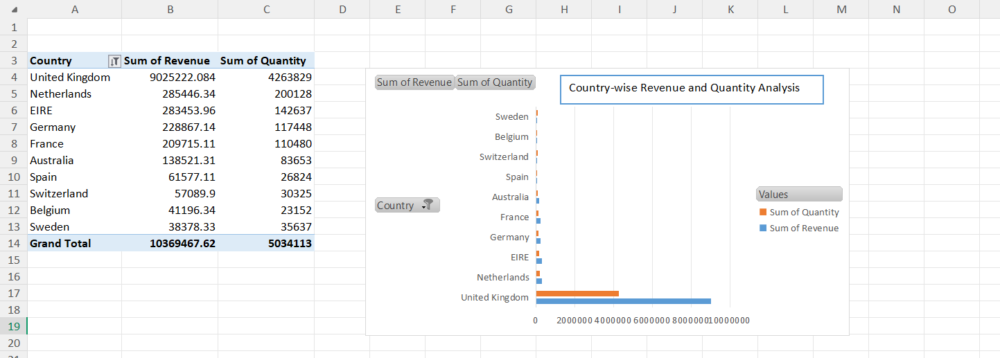
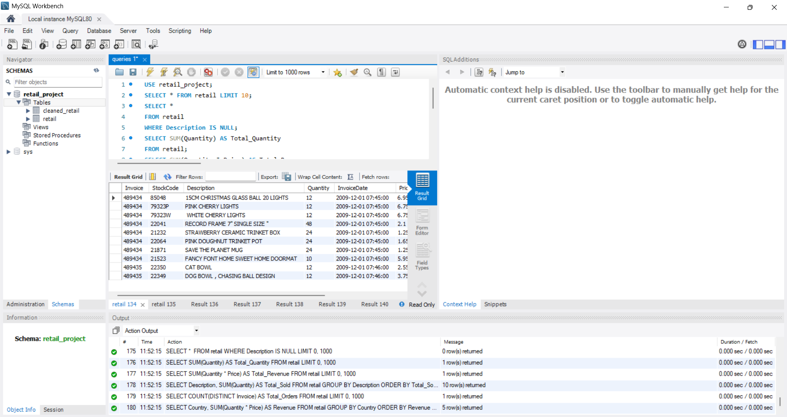

# Retail Analytics Project

##  Description
This project analyzes retail transaction data using SQL and visualizes insights using Excel.

## Tools Used
- MySQL
- MySQL Workbench
- Microsoft Excel

## Analysis Performed
- Total Revenue & Quantity
- Top Selling Products
- Country-wise Sales
- Monthly Sales Trends
- Customer Analysis

## Visualization
Excel was used to create pivot tables and charts for better understanding of trends.

## Files Included
- queries.sql
- retail_analytics_report.pdf
- Screenshots
  
## Sample Output

### Country-wise Analysis

### Monthly Trend

##  Outcome
This project helped in understanding sales patterns, customer behavior, and business insights using data analysis techniques.
